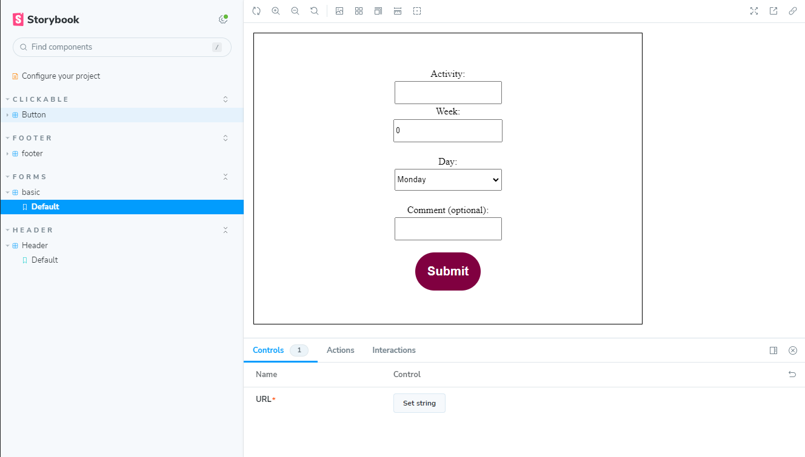

### Compents-CI-CD-pipeline-GruppFem
<br>



## **Kurs**: Paketering, leverans och uppföljning

### Grupp 5: 

* Yulia Gutorova
* Una Paruma
* Jonathan Nilsson   
* Patrick Nyberg   

# Uppgift: CI / CD PIPELINE


**Mål**: *Slutmålet av uppgiften är att skapa en automatisering som driftsätta ett komplett system som är testat och dokumenterat.*

**Hur vi löste uppgiften:** *Teamet valde att skapa en aktivitetsplanerare,eftersom den ger möjlighet att göra en CRUD-applikation och funktionalitet att skriva tester och skapa en robust pipeline*

### Inställningar:

```js
git clone https://github.com/Jonathannilsson90/Components-CI-CD-pipeline-GruppFem.git
npm install

```

### Starta Storybook:

```js
npm run storybook
```

### Skapa en dist-fil med hjälp av rollup:
```javascript
npm run rollup
```


### Publicera npm-paket till npmjs:
```javascript
npm login
npm publish --access public (--access public flaggan behövs enbart första gången)
```

### Tekniker:

* [Husky](https://www.npmjs.com/package/husky) - En förenklad version utav git-hooks där det går att använda JavaScript för att automatisera tester innan händelser, t ex pre-commits.
* [Storybook](https://storybook.js.org) - Ett ramverk för att kunna bygga kompenter i en testmiljö som är mer anpassningsbar för användare och utvecklare.
* [Rollupjs](https://rollupjs.org) -Ett verktyg för att "minifiera" kod och skapa distrubtionsbyggen för att underlätta publicering av kod.
